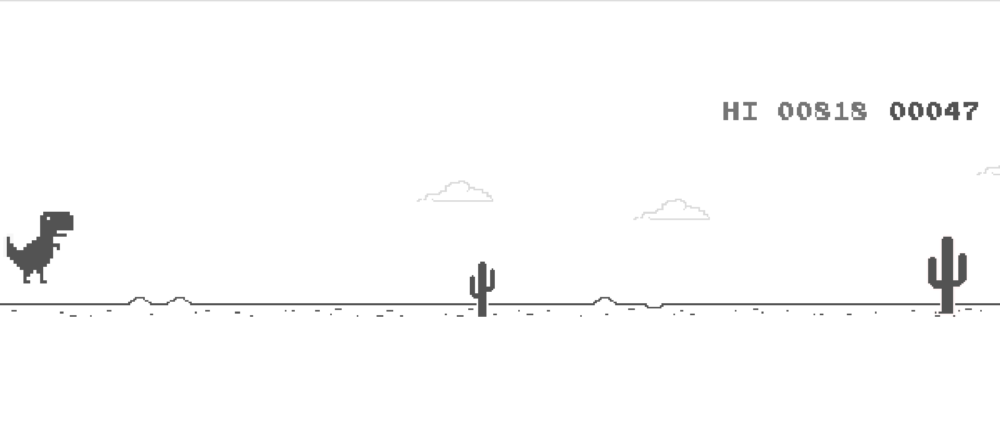

# Introduction
This repository contains an implementation of a Deep Q-Learning Network to play T-Rex google's game. 

# Environment
We will be using Selenium which is a portable framework for testing web applications and provides Python API interface for controls.

# Setup 
⋅⋅* After installing required packages make sure to install chrome driver from  [here](https://chromedriver.chromium.org/downloads)
⋅⋅* Specify the path of the chromedriver.exe in the dqn.py file. 
⋅⋅* Finally run  : 

```
python dqn.py 

```

# Screenshot 





# References 

⋅⋅* https://medium.com/analytics-vidhya/reinforcement-learning-dino-bot-613c6daeea5d  

⋅⋅* https://gist.github.com/kharepratyush/8c87d209f6ba657597e3f919c23bd946
